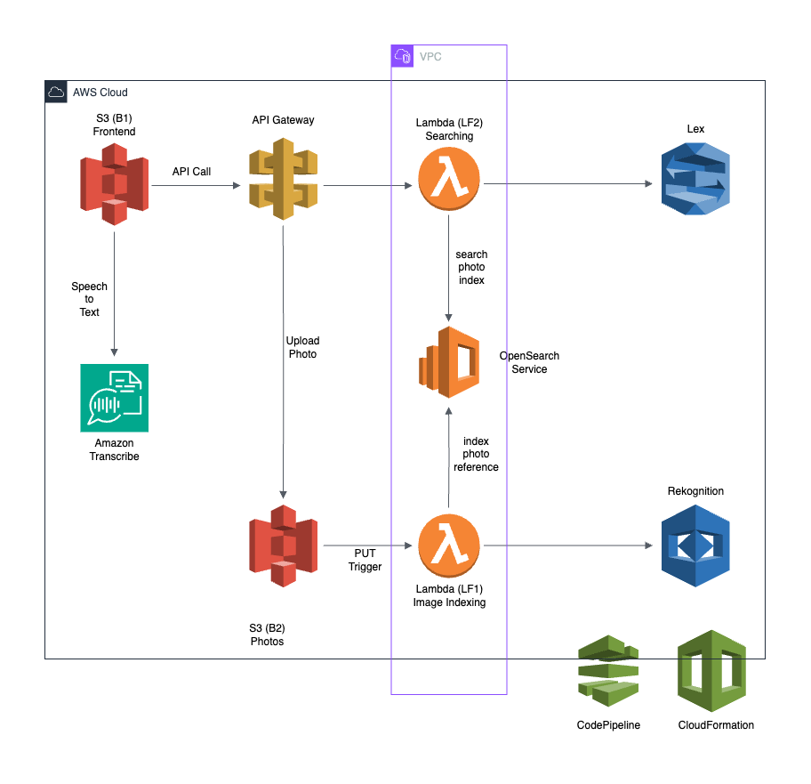

# photo-album-app

In this assignment, we will building a Photo Album Web application using AWS
services. The application adds an an intelligent search layer to query your
photos using natural language through both text and voice.

## Screenshots

Checkout the [screenshots.md](./screenshots.md) for a detailed walkthrough of
the project.

## Architecture

## Frontend

The frontend is a static website hosted on Amazon S3. The website is built using
HTML/CSS, and JavaScript. The website uses the AWS SDK for JavaScript to
interact with the backend services.

[vchrombie/photo-album-app-frontend](https://github.com/vchrombie/photo-album-app-frontend)

## AWS Services

- [Amazon S3](https://aws.amazon.com/s3/)
- [Amazon API Gateway](https://aws.amazon.com/api-gateway/)
- [AWS Lambda](https://aws.amazon.com/lambda/)
- [Amazon OpenSearch Service](https://aws.amazon.com/opensearch-service/)
- [Amazon Lex](https://aws.amazon.com/lex/)
- [Amazon Cloud9](https://aws.amazon.com/cloud9/)
- [Amazon CloudFormation](https://aws.amazon.com/cloudformation/)
- [Amazon CodePipeline](https://aws.amazon.com/codepipeline/)
